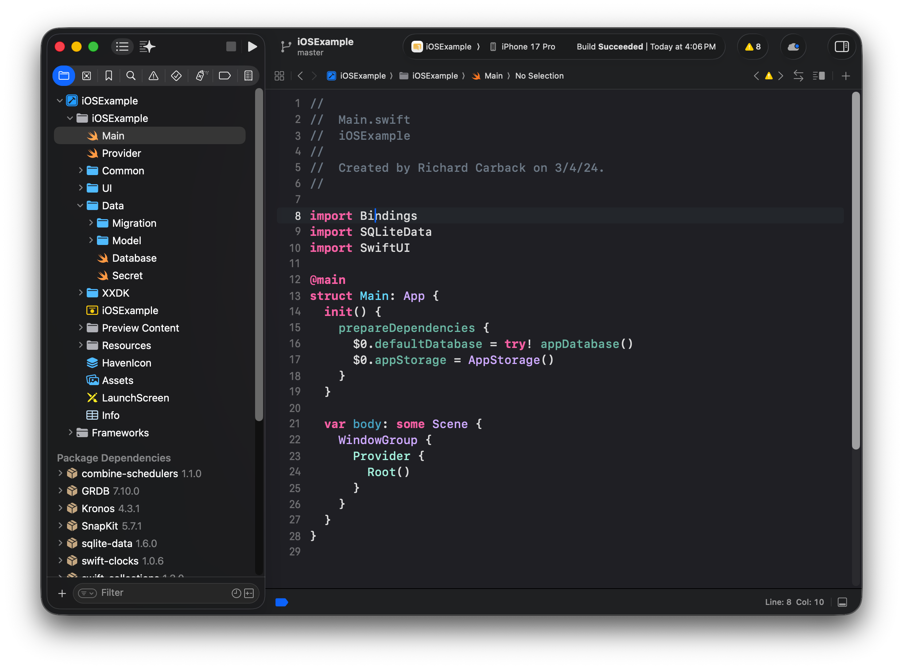

# Haven App

This project is based on the iOS example in [xxdk-examples](https://git.xx.network/xx_network/xxdk-examples/-/tree/f64201e9c426a64b15e9d2608003939f3c9184e5/iOS).

> **Note:** It should take less than one minute for the app to set up a new user, though this depends on network conditions.

## Setup

Follow these steps to get the app running locally with the iOS Simulator.

### Prerequisites

- **Xcode:** Developed with Xcode 26. The current latest version should work.

### Setup

Open the project in Xcode:

```bash
open iOSExample.xcworkspace
```

You should see the following in the file browser:



This project uses SPM(Swift Package manager) and it should fetch dependencies automatically.

You can run build or run in simulator to test the application.

## Dependencies

This project relies on the following Swift packages (managed via SPM):

- **SnapKit:** A Swift Autolayout DSL for iOS UIKit, used for programmatic UI layout (e.g., chat message bubbles).
https://github.com/SnapKit/SnapKit
- **Kronos:** An elegant NTP date library for Swift, used to get accurate network time for XXDK operations.
https://github.com/MobileNativeFoundation/Kronos
- **SwiftSoup:** A Swift HTML Parser, used for parsing and formatting HTML content in chat messages.
https://github.com/scinfu/SwiftSoup
- **SQLiteData:** Based on GRDB, used for robust and type-safe SQLite database management.
https://github.com/pointfreeco/sqlite-data
- **xxdk-spm:** The Swift Package Manager wrapper for the XXDK (xx network development kit), providing core network functionality.
https://github.com/thisisommore/xxdk-spm

## Contributing

### Formatting

We use [SwiftFormat](https://github.com/nicklockwood/SwiftFormat) to format our Swift files.

```bash
# Install
brew install swiftformat

# Run
swiftformat .
```

### Linting

We use [SwiftLint](https://github.com/realm/SwiftLint) to lint our Swift files.

```bash
# Install
brew install swiftlint

# Run
swiftlint .
```

## Architecture

### View Controller Pattern

Most of the app relies on a view controller pattern. Logic and state management live in a controller (`+Controller.swift`), which SwiftUI view should initialize and call as needed.

### Main.swift & Entrypoint

Everything starts with `Main.swift`. It acts as a container for `Provider` and `Root` and should be kept as clean as possible (< 30 lines).

- **Provider:** Initializes all dependencies using Swift's dependency and environment systems, providing all required global dependencies.
- **Root:** Handles all initial logic, including the navigation stack, deep links, and initial routing (e.g., separating new vs. returning users).

### Data

All persistent data-related code lives in the `Data` folder. This includes:

- Database logic powered by `SQLiteData`.
- Secrets management using Apple Keychain.
- Key-value storage using `UserDefaults`.

##### Migrations

New database changes go in `Data/Migration`. Raw SQL is preferred because it is easy to read and avoids assumptions an ORM might make. Migrations should extend `DatabaseMigrator`.

```swift
extension DatabaseMigrator {
  mutating func v2() {
    self.registerMigration("v2:hello") { db in
      try #sql(
        """
        CREATE TABLE "hello"(
          "id" TEXT NOT NULL PRIMARY KEY
        ) STRICT
        """
      )
      .execute(db)
    }
  }
}
```

Migrations should then be called sequentially in `Database.swift`:

```swift
migrator.v1()
migrator.v2()
migrator.v3()
// ...
try migrator.migrate(database)
```

### UI & Navigation

- **Navigation:** We use a `Destination` enum to define navigation destinations. See `Navigation.swift` for details.

    ```swift
    enum Destination: Hashable {
        case home
        case landing
        // ...
    }

    extension Destination {
        @MainActor @ViewBuilder
        func _destinationView() -> some View {
            switch self {
            case .landing:
                LandingPage<XXDK>()
            case .home:
                HomeView<XXDK>()
            // ...
            }
        }
    }
    ```

- **Pages:** All screens and pages live in the `Pages` folder. The entry point for a page is defined by `*.page.swift`.
    - Previews are heavily utilized to build UI quickly without waiting for full builds to complete.
    - `PreviewUtils` contains mock functions that can be attached to any preview to quickly set up the necessary data and environment.

### XXDK

All XXDK-related code (bindings, callbacks, documentation) lives in the `XXDK` folder.

- **Best practice:** When using XXDK, always use the `XXDKP` protocol. This ensures that mocks can be provided in place without requiring major code changes, which is especially useful in SwiftUI Previews.

## Code Style

### Naming Conventions

#### Controllers

Controllers follow the `+Controller` suffix pattern. They manage state and logic for SwiftUI views.

```swift
@Observable
class ChatController {
  var messages: [Message] = []
}
```

#### Extensions

Use extensions to separate groups of related code:

```swift
class A { /* props, init */ }
extension A { /* methodA, methodB */ }
```

#### +ABC.swift

In Swift, scope is shared across files, so identical file names in different folders collide. Use the `+XYZ` prefix pattern to avoid this.

#### Protocols

Use protocols to support mocking and previews — they allow you to replace a real implementation with a mock. Also use protocols to define common types and methods. For example, we use the `CellWithContextMenu` protocol to determine whether a cell supports a context menu.

### Formatting

#### Line Length

Try to keep files under 500 lines.

#### Linting & Formatting

Lint and formatting configs are provided. Use them to maintain the codebase and catch bugs early.

#### SwiftUI View Property Ordering

For SwiftUI views, follow this strict property ordering:

1. Controller state
2. Normal vars (non-state, props, `@Binding`)
3. Environment variables
4. `@Dependency`
5. Fetch hooks
6. `@State` / `@FocusState`
7. Anything else (helper methods, constants)
8. `body` (always last)

**Example:**

```swift
struct ExampleView: View {
  // 1. Controller state
  @State private var controller = ExampleController()

  // 2. Normal vars / props / @Binding
  let title: String
  @Binding var isPresented: Bool

  // 3. Environment variables
  @EnvironmentObject private var appState: AppState
  @Environment(\.dismiss) private var dismiss

  // 4. Dependencies
  @Dependency(\.defaultDatabase) private var database

  // 5. Fetch hooks
  @FetchAll(Item.order { $0.name }) private var items: [Item]
  @FetchOne private var selectedItem: Item?

  // 6. States
  @State private var searchText = ""
  @FocusState private var isSearchFocused: Bool

  // 7. Anything else
  private func hello() {
    AppLogger.app.info("hello")
  }

  private var pageSize = 20

  // 8. Body
  var body: some View {
    Text(title)
  }
}
```