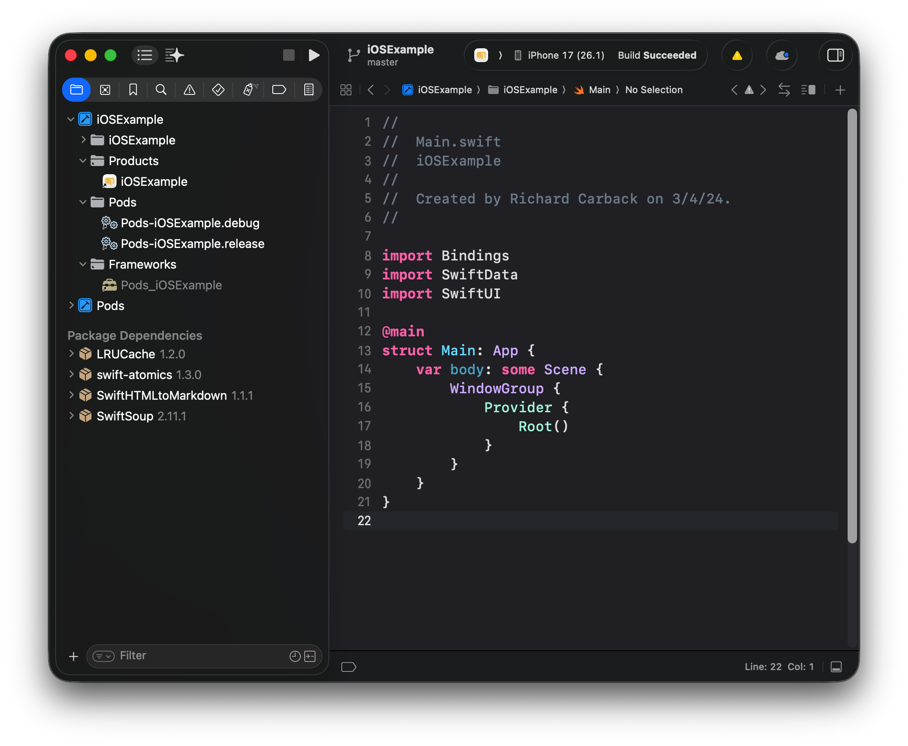

# Intro

Haven App for iOS and iPadOS \
This is based on the iOS example in xxdk-examples \
https://git.xx.network/xx_network/xxdk-examples/-/tree/f64201e9c426a64b15e9d2608003939f3c9184e5/iOS

# Structure

### Startup

Everything starts with Main.swift
It initiates Provider and uses Root
Root handles all the initial logic,
like

- navigation stack
- deep link
- initial routing according to new or old user

### Navigation

For navigation, we use a Destination enum with navigation destination

```swift
enum Destination: Hashable {
    case home
    case landing
    // ...
}

extension Destination {
    @MainActor @ViewBuilder
    func _destinationView() -> some View {
        switch self {
        case .landing:
            LandingPage<XXDK>()

        case .home:
            HomeView<XXDK>()
        // ...
```

See Navigation.swift for more info

### Pages

All pages/screens are stored in the Pages folder, the entry point is defined by \*.page.swift
Previews are used to quickly build UI without waiting for heavy builds to complete.
PreviewUtils contains mock function which can be attached to any preview to quickly setup all necessary data and environment for preview.

### Data

All Swift data models are defined in the Model folder

### Secrets

Secret.swift is used to store the password used for cmix

### XXDK

All XXDK related code is in the XXDK folder, including documentation

# Requirements

### Xcode

This was developed with Xcode 26 \
Current latest version should work

https://developer.apple.com/xcode/resources/

### CocoaPod

This project uses Swift Package Manager along with CocoaPods, Xcode should take care of the former.
For CocoaPods, it is required to install the dependencies or else build will fail

You will need to install CocoaPods

```
brew install cocoapods
```

After it is installed, you can run the following in the Terminal to download
the dependencies to the `Pods` folder:

```
pod install
```

Now open the project with:

```
open iOSExample.xcworkspace
```

And you should see the following in the file browser:



# Contributing

## Formatting

SwiftFormat is used to format Swift files
https://github.com/nicklockwood/SwiftFormat

Installing

```bash
brew install swiftformat
```

Running

```
swiftformat .
```
